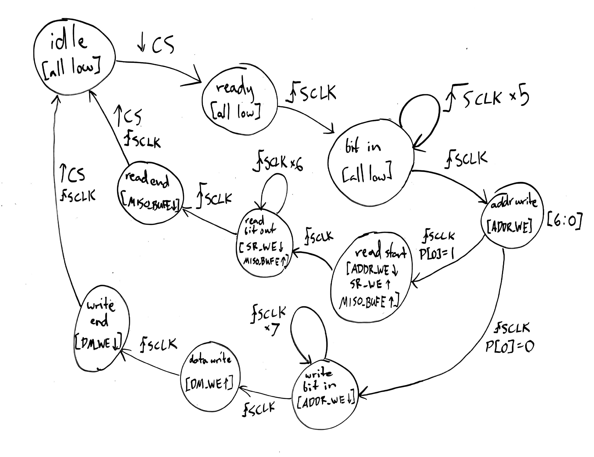

# Lab 2 Writeup
### William Derksen, Alexander Hoppe, Sam Myers, Taylor Sheneman

## Input Conditioner
- tests (sync, debounce, edges)
- Waveforms
- Structural Schematic
- Debounce glitch time analysis

## Shift Register
- architecture?
- tests (serial to parallel, parallel to serial)
- Test bench strategy

## Midpoint FPGA Implementation

We tested the intermediate input conditioner/shift register device by uploading it to an FPGA with LED outputs. Serial and parallel inputs and outputs all worked as expected.

## SPI peripheral components

Data Memory: A two dimensional array of values that behaves according to typical data memory control signals. Takes data input from shift register, address from address latch, and write enable signal DM_WE, outputs to shift register.

Address Latch: A state-holding latch with write enable ADDR_WE, takes shift register parallel out and outputs to data memory.

MISO buffer: D flip-flop with a tri-state buffer. Takes shift register serial out, outputs to MISO pin on negative edges (while enabled with MISO_BUFE).

## Finite State Machine

For all these components to work together properly, we need precisely timed control signals to coordinate their actions. We abstracted out this control signal logic into a finite state machine (FSM) component, intended to track the current state of the SPI transaction and output the necessary control lines. The FSM is able to read two signal lines from the master SPI bus (Chip Select CS and SPI Clock SCLK) and has access to the least significant bit of the shift register.

Functionally, the state machine must:
  - Recognize the beginning of a transaction
  - Wait for the appropriate number of clock cycles while address bits are read in
  - Enable the write to the Address Latch to save address bits
  - Check the incoming Read/Write bit
  - (Write operation) Wait for data to be written to the shift register
  - (Write operation) Write to data memory at the previously saved address
  - (Read operation) Enable parallel load from data memory to the shift register
  - (Read operation) Allow bits to be read out of the shift register on the MISO line
  - Reset to idle state at the end of the transaction

Our design, made to fulfill these requirements:

This was implemented in code in a switch-case pattern, with each case corresponding to a control state, which defines the state of the four possible control signal outputs.

Other stuff about the code?

Tests???

## SPI Memory

Finally, we wrote a top-level SPI module that connected all the appropriate component ports into a complete SPI memory module.

TESTSTESTSTESTS

## Work Plan Reflection

Scheduling turned out to be pretty difficult this time around, so we ended up doing a lot of work in more concentrated periods, rather than spread out as we planned. Almost none of the deadlines we planned for ended up being accurate. We spent significantly longer on the finite state machine than we expected, and as usual, despite our efforts to the contrary, testing took a lot longer than we planned for. On the other hand, we planned for building a lot of components from scratch that were actually already written in the initial code, so that helped to make up for some of our unexpected slowdowns. The most problematic deviation from the plan is probably that we didn't get the complete device working until Thursday night.
